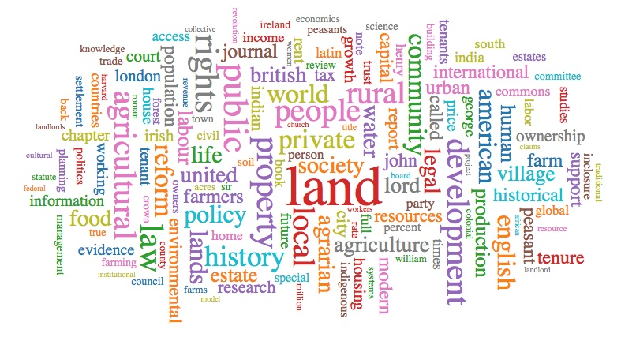
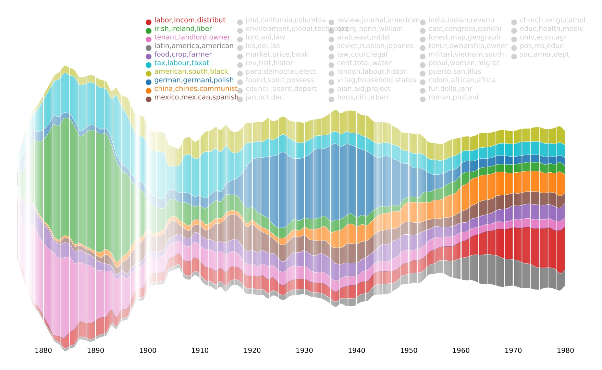
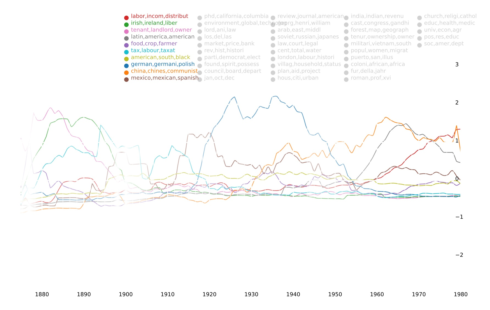
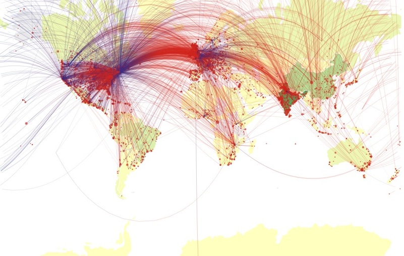

# Examples

These visualizations are generated from a corpus of ~3,500 documents related to land reform. 

## Word Cloud

A word cloud with TF-IDF filtering (removes words that are extremely common).

## Topic Models

The evolution of 10 topics over time, out of a 50-topic LDA topic model. The height of each colored area shows the proportion of the corpus dedicated to that topic. Labels for the other topics in the model are shown in light gray.

The same data shown as standard deviations above or below the mean prevalence of the topic.

## Geoparser

Displays the connections in the corpus between a text's place of publication and the places to which it makes reference. Lines start out blue at the place of publication and turn red as they reach their targets. Places that are both sources and targets of text will turn purple, though this may be obscured by overlapping data points.

See also a [live demo](examples/geoparse.html) of this display.